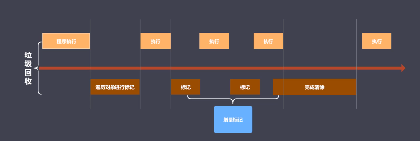

## JavaScript 中的内存管理
- 内存：由可读写单元组成，表示一片可操作空间。
- 管理：人为的去操作一片空间的申请、使用、释放。
- 内存管理：开发者主动申请空间、使用空间、释放空间。

## JavaScript 垃圾回收定义
- 垃圾：
  - 在 JS 中内存管理是自动的，每次声明一个变量时便会自动帮我们申请内存空间。
  - 当一个对象不再被外界引用时便会被当做垃圾。
  - 当一个对象不能从根上访问到时便会被当做垃圾。
- 可达对象：
  - 可以访问到的对象就叫做可达对象。
  - 可达的标准就是从根出发是否能够被找到。
  - JS 中的根可以理解为全局变量对象

## GC
- GC 是垃圾回收机制的简写，它可以找到内存中的垃圾、并释放和回收空间。
- GC 如何找到内存中的垃圾、并释放回收空间？(GC 算法)
  - 引用计数
  - 标记清除
  - 标记整理
  - 分代回收

## 引用计数
- 核心思想：设置引用数，判断当前引用数是否为0
  - 为变量设立一个引用计数器
  - 当变量的引用关系发生改变时立刻修改引用数字
  - 变量引用数字为 0 时立即回收
- 优点：
  - 发现垃圾时立即回收
  - 最大限度的减少程序的暂停（因为立即回收垃圾，所以垃圾的存在时间短，节省内存，内存爆满的现象不会发生）
- 缺点：
  - 无法回收循环引用的对象
  - 时间开销大资源消耗大（相对于其他算法来说，因为要时刻监听每一个对象的引用关系。）

## 标记清除法
- 核心思想：分为标记、清除两个阶段
  - 标记阶段会将内存中存在的所有变量添加标记（在根上出发，找到所有的可达对象，添加标记）
  - 清除阶段会遍历内存中所有的变量，将没有标记的变量清除。（没有标记的变量便是那些不可达对象）
  - 回收对应的内存空间。
- 优点：
  - 解决了计数法所解决不了的循环引用问题
- 缺点：
  - 不会立即回收垃圾。
  - 空间碎片化问题，浪费空间。当标记清除法回收垃圾之后，这些空间会被放到空闲列表上，但是这些空间在地址上是不连续的。当我们再次申请空间时会优先在空闲列表上申请，当要申请的空间大小不匹配空闲列表中的的空间时就会导致空间碎片化问题。
  - 这个不匹配是指当我空闲列表中有两个空间，一个能容纳2个字节的空间，一个是1个字节的空间，表面上是该空闲列表中存在3个字节的空间但是因为他们的地址是不连续的。当我申请1.5个字节的空间时这两部空间便无法使用。

## 标记整理算法
- 核心思想：标记整理是对标记清除法的增强
  - 标记阶段的操作与标记清除法一致
  - 而清除阶段则会先执行整理、移动对象位置的一种操作，通过这种操作将标记对象既活动对象移动到连续的地址空间上，然后将剩余的无标记对象（不可达对象）清除，通过这样一种操作，可以将剩余空间地址尽可能的连续化，以此来解决标记清除法的弊端。
  
## V8 引擎
- 一款主流的 js 执行引擎
- 采用即时编译 其他引擎需要将源代码转为字节码才能执行而 V8 引擎可以将源码直接转成机器码执行，速度快。
- 内存设限 64位操作系统不超过1.5G， 32位不超过800M，这样的内存设定是因为 1.对于浏览器的网页应用来说这内存足够用。2.V8 的垃圾回收机制也决定了这样的内存机制。当垃圾内存达到1.5G的时候，通过标记增量方式回收需要50毫秒，而通过非标记增量方式回收则需要1s，这对于用户来说是已经够久了，所以以1.5G为界。
  
## V8 垃圾回收策略
- 采用分代回收的思想
- 内存分为新生代跟老生代
- 针对不同对象采用不同GC算法

## V8 常用的GC算法
- 分代回收
- 空间复制
- 标记清楚
- 标记整理
- 标记增量

## V8 内存分配
- 空间一分为二
- 小空间存放新生代对象（32M|16M）
- 新生代存放的都是存活时间较短的对象
- 大空间存放老生代对象（1.4G|700M）
- 老生代存放的是存活时间较长的对象
  
## V8 如何回收新生代对象
- 回收过程采用复制算法 + 标记整理
- 新生代内存首先会被区分为两个等大小空间（空间换时间，为了提高效率）
- 使用状态为From，空闲状态为To
- 所有的活动对象会存储到使用空间 From 中
- 当From空间内存应用到一定程度之后会触发GC，GC会将From中的对象标记整理后拷贝到To中
- 完全释放 From 空间
- From 空间然后与 To 互换

## 新生代对象的晋升
- 晋升是指新生代对象移动到老生代
- 当两轮GC过后还存活的的新生代就会晋升
- 除此之外当To空间使用率高于25%是这些对象也会晋升（原因是To空间最终会置换到From空间，如果To空间使用率过高会导致置换后的From剩余空间变少，怕不够存储新对象。）
  
## V8 如何回收老生代对象
- 采用标记清除法、标记整理、增量标记法
- 首先采用标记清除法完成垃圾空间的回收操作，因为标记清除法速度快，会导致空间碎片化问题。
- 当新生代晋升时，此时老生代如果没有空间存储便会采用标记整理法对碎片化空间进行整理优化。
- 采用增量标记法进行效率优化

## 标记增量如果做效率优化
- 
- 如图所示，当GC进行对象遍历进行标记时，js是会被阻塞的，这种现象叫全停顿，她们两个是互斥的，直到标记完成才会继续执行js代码，当垃圾很多时会造成程序的卡顿，而增量标记是指将一次做完对象的遍历标记的过程分成多次执行，这样做之后因为要遍历的对象变少，时间消耗就少，感受不到程序的卡顿。

## V8 老生代与新生代回收的细节对比
- 新生代采用分为两个等大小空间，采用复制算法的原因是为了空间换时间提高效率。这样做新生代中永远会有一个空闲空间给我们使用，虽然会浪费空间但是新生代空间本来就小，这种浪费带来的效率提升是值得的。
- 老生代不采用这种方式有两个原因，一是老生代空间大，一分为二之后也浪费了大量内存，不值得。二是老生代空间大，复制会很耗时。所以不适合。
  