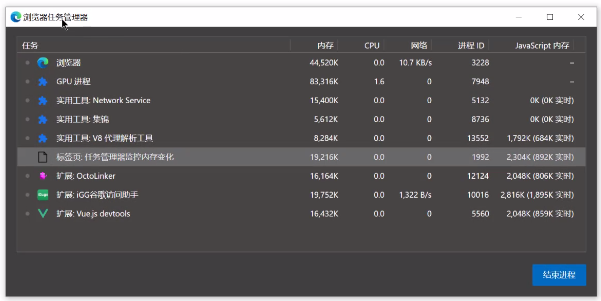
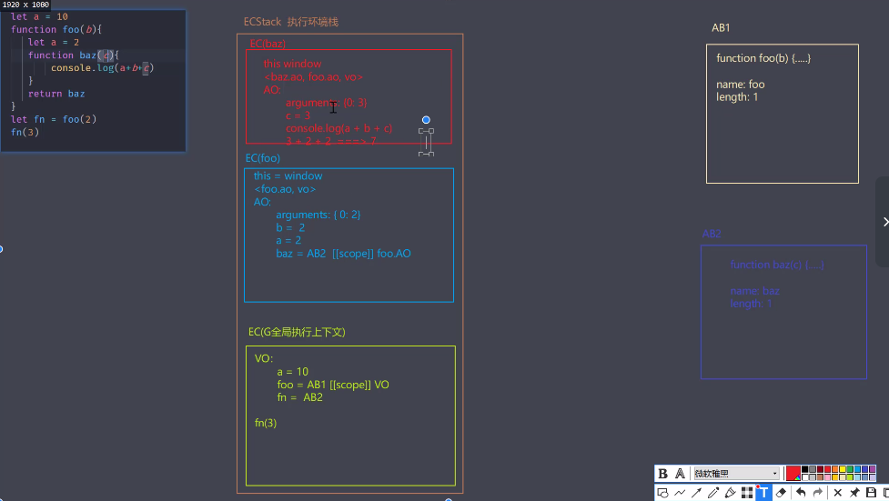

## 内存问题的外在表现
- 页面出现延迟加载或经常性的暂停
- 页面持续性性能糟糕
- 页面性能随时间增长越来越差

## 监控内存的几种方式
- 浏览器任务管理器 (shift + esc) 内存表示DOM占据 js内存代表js对象占据内存 括号内代表可达对象占据内存
  
  
- Timeline 时序图记录（浏览器的F12录制工具）  
- 堆快照查找，分离DOM

  当一个元素不存在在DOM树上且没有JS引用时，这个DOM就是垃圾，需要被回收。而当一个元素**不存在DOM树上但是有JS引用时**，我们在界面上看不到该DOM，但是他却依然占据空间，这就会造成内存泄漏。通过堆快照查找，定位该问题解决内存泄漏。
- 判断是否存在频繁的垃圾回收（Timeline 频繁上升下降，浏览器任务管理器数据时大时小）
  
  GC 工作时应用程序是停止的，频繁且过长的 GC会导致应用程序假死，用户使用感知卡顿。

## 代码优化
- 慎用全局变量
  - 全局变量定义在全局执行上下文，是所有作用域链的顶端（查找会从下往上查找，导致查找缓慢）
  - 全局执行上下文一直存在于上下文执行栈，直到程序退出（变量无法释放）
  - 如果某个局部作用域出现同名变量会覆盖或污染全局变量
- 缓存全局变量 使用全局变量时预先定义局部变量并赋值为全局变量 使用该局部变量进行操作会有少量的性能提升
- 通过原型对象上新增对象实例需要的方法
- 避开闭包陷阱
  - 闭包使用不当容易出现内存泄漏
- 避免属性访问方法使用 最好直接取属性，而不是添加一个方法来获取属性值
- For 循环优化
- 选用最优的循环方式 forEach > for > forin
- 优化DOM节点添加 容易造成回流 先新建节点放入到DocumentFragment，一次性将新建的节点添加到文档中
- 克隆优化DOM节点操作 
- 直接量替换 new Object
  - var a = [1,2,3] > var a = new Array()

## 堆栈中的 JS 执行过程

## 代码优化
- 减少判断层级 尽量使用return扁平化判断层级
- 较少作用域链查找层级
- 减少数据的读取次数 引用外部作用域数据时可先声明一个变量缓存该数据
- 字面量代替构造式
  - let obj = {} > let obj = new Object()
- 减少循环体活动 在循环体中尽可能做最少的事 while 循环 > for 循环
- 减少声明及语句数
- 采用事件绑定 事件委托