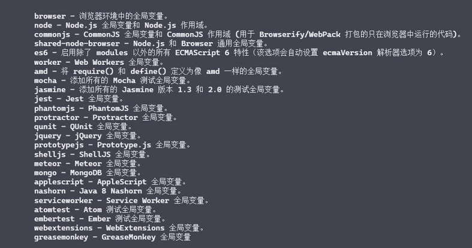

## 介绍
- 最为主流的 js Lint 工具 用于检测 JS 代码质量
- ESLint 很容易实现统一开发者的编码风格
- ESLint 可以帮助提高开发者的编码能力

## 安装
- 在项目中安装 ESLint 开发依赖
- 通过 CLI 命令验证安装结果
1. yarn add eslint -D
2. yarn eslint --version 查看 eslint 版本信息
3. yarn eslint --init 生成配置文件
4. yarn eslint file-path --fix 

## 配置文件 .eslintrc.js
- env 可以使用的环境配置，可以同时开启多个环境 负责判断某些成员是否可用

- extends 继承 使用多个共享的eslint配置
- parseOptions 配置语法解析器的相关配置 只检测语法，不负责判断某些成员是否可用
  - ecmaVersion 配置可以使用的js版本
- rules 规则配置
- globals 设置代码中可以使用的全局对象
- plugins 使用插件 名称为包名去掉 eslint-plugin- 例如 eslint-plugin-react => plugins:['react'] 

## ESLint 配置注释
- // eslint-disable-line 代表eslint校验时忽略此行代码 在后边添加某个检验规则 也代码在这行忽略某一个检验规则

## 结合webpack
- 集成之后不必每次手动执行命令
- 与项目统一，方便管理

1. 安装eslint eslint-loader
2. 初始化eslint配置文件
3. 配置一个前置loader 使用eslint-loader就欧克了

