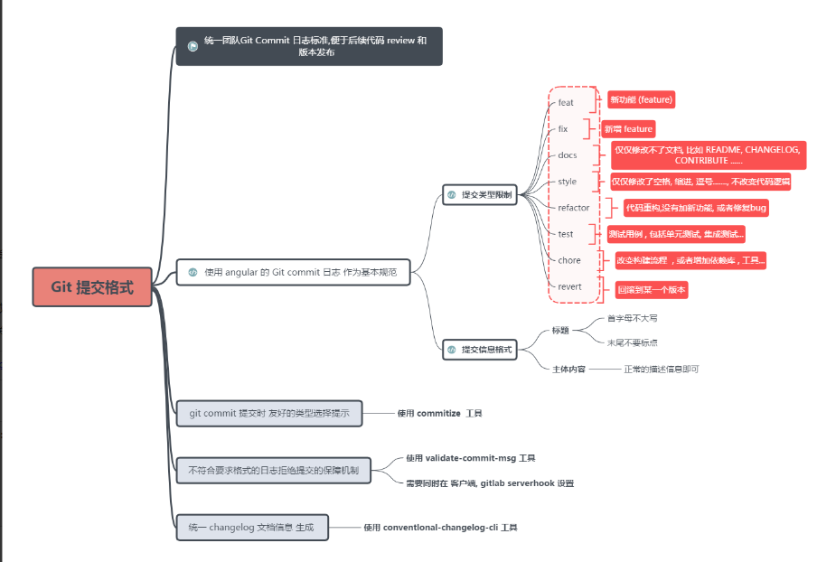

## 目的
- 统一团队Git Commit标准，便于后续代码review、版本发布、自动化生成change log；
- 可以提供更多更有效的历史信息，方便快速预览以及配合cherry-pick快速合并代码；
- 团队其他成员进行类git blame时可以快速明白代码用意；

## Git版本规范
- master分支为主分支(保护分支)，不能直接在master上进行修改代码和提交；
- develop分支为测试分支，所以开发完成需要提交测试的功能合并到该分支；
- feature分支为开发分支，大家根据不同需求创建独立的功能分支，开发完成后合并到develop分支；
- fix分支为bug修复分支，需要根据实际情况对已发布的版本进行漏洞修复；

## Tag
- 采用三段式，v版本.里程碑.序号，如v1.2.1
- 架构升级或架构重大调整，修改第2位
- 新功能上线或者模块大的调整，修改第2位
- bug修复上线，修改第3位

## changelog
版本正式发布后，需要生产changelog文档，便于后续问题追溯。

## Git提交信息
### commit message格式说明
- Commit message一般包括三部分：Header、Body 和 Footer。
- Header type(scope):subject
1. type：用于说明commit的类别，规定为如下几种
   1. feat：新增功能；
   2. fix：修复bug；
   3. docs：修改文档；
   4. refactor：代码重构，未新增任何功能和修复任何bug；
   5. build：改变构建流程，新增依赖库、工具等（例如webpack修改）；
   6. style：仅仅修改了空格、缩进等，不改变代码逻辑；
   7. perf：改善性能和体现的修改；
   8. chore：非src和test的修改；
   9.  test：测试用例的修改；
   10. ci：自动化流程配置修改；
   11. revert：回滚到上一个版本；
2. scope：【可选】用于说明commit的影响范围
3. subject：commit的简要说明，尽量简短

- Body 对本次commit的详细描述，可分多行
- Footer 1. 不兼容变动：需要描述相关信息 2. 关闭指定Issue：输入Issue信息
